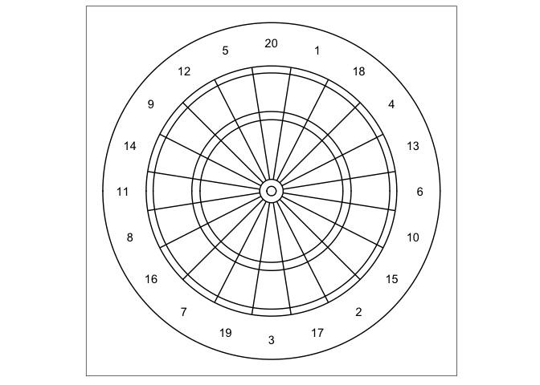

<!-- README.md is generated from README.Rmd. Please edit that file -->
dartboard
=========

The goal of dartboard is to creat an object with all the correct dimensions of a dartboard and use it as an input into dart strategy simulations.

Installation
------------

You can install a development version of `dartboard` from [GitHub](https://github.com) with:

``` r
devtools::install_github("chringer-git/dartboard")
```

Walkthrough
-----------

### Example 1: Create a dartboard

``` r
library(dartboard)

db <- create_dartboard()
```

### Example 2: Draw the dartboard

``` r
draw_dartboard(db)
```


